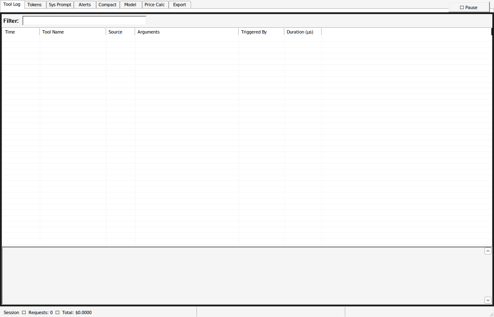

# CopilotScope — The AI Service Monitor

[]()
[]()
[-blue)]()
[]()
[]()
[]()

> **Operator:** Lackadaisical Security  
> **Target OS:** Windows 10 22H2+ / Windows 11  
> **Stack:** C/C++ (Win32) · TypeScript (VS Code Extension — optional) · Node.js · WiX MSI

A forensic-grade, always-on observer that sits between your AI client apps and **every** major
AI service provider, logging **everything** — tool calls, actual token flows, system prompt
mutations, compaction events, model switches, and any event that fires without explicit user action.

> **Universal capture** — works with VS Code/Copilot, Claude.ai desktop, ChatGPT desktop,
> Cursor IDE, Windsurf, and any AI tool via the HTTPS intercept proxy. The VS Code extension
> is **optional sidecar** enrichment, not a requirement.

It calculates the true price of each request, shows the real context window state (not the
reported one), flags anomalies in real time, and exports a full session audit trail.

---

## Screenshots

See [docs/screenshots.md](docs/screenshots.md) for full-size live screenshots.



---

## Architecture

```
┌─────────────────────────────────────────────────────────────┐
│                      WINDOWS MACHINE                        │
│                                                             │
│  Any AI Client App ──────────────────────────────────────┐  │
│  (VS Code, Claude desktop, ChatGPT, Cursor, Windsurf…)   │  │
│                                                          │  │
│  ┌──────────────────────────────────────────────────┐    │  │
│  │   HTTPS INTERCEPT PROXY  (Universal capture)     │◄───┘  │
│  │   127.0.0.1:8877 — Node.js                       │       │
│  │   Providers: Copilot, OpenAI, Anthropic,          │       │
│  │   Gemini, Azure, Cursor, Windsurf, Mistral…       │       │
│  └──────────────────────────┬───────────────────────┘       │
│                             │ stdout JSON events             │
│  ┌──────────────────────────▼───────────────────────┐       │
│  │         COPILOTSCOPE DAEMON (copilotscoped.exe)   │       │
│  │         C++ Win32 · tray icon · singleton         │       │
│  │  ├─ Named pipe server (ext+proxy → daemon)        │       │
│  │  ├─ Process watcher (WMI)                         │       │
│  │  ├─ ETW network tap                               │       │
│  │  ├─ Token counter + price calculator              │       │
│  │  ├─ Anomaly engine (CS-XXXX rules)                │       │
│  │  ├─ Alert triage                                  │       │
│  │  └─ Session store (SQLite WAL)                    │       │
│  └──────────────────────────┬───────────────────────┘       │
│                             │ Named Pipe                     │
│  ┌──────────────────────────▼───────────────────────┐       │
│  │       COPILOTSCOPE GUI (copilotscope.exe)         │       │
│  │       C++ Win32 · 8 tabbed panels                 │       │
│  │  Tool Log │ Tokens │ Sys Prompt │ Alerts           │       │
│  │  Compact  │ Models │ Pricing    │ Export           │       │
│  └───────────────────────────────────────────────────┘       │
│                                                             │
│  ┌─────────────────────────────┐  (OPTIONAL — VS Code only) │
│  │  VS Code Extension Sidecar  │                            │
│  │  copilotscope-sidecar.vsix  │  Richer in-process hooks:  │
│  │  TypeScript · VS Code 1.90+ │  • tool trigger classify   │
│  └─────────────────────────────┘  • context window snapshot │
│                                   • compaction detection    │
└─────────────────────────────────────────────────────────────┘
```

---

## Supported Providers (Proxy — no extension required)

| Provider | Hosts intercepted | Client apps |
|----------|------------------|-------------|
| GitHub Copilot | api.githubcopilot.com | VS Code, JetBrains, CLI |
| **Claude / Anthropic** | api.anthropic.com | Claude.ai desktop, Claude Code |
| **OpenAI** | api.openai.com | ChatGPT desktop, any SDK |
| Azure OpenAI | *.openai.azure.com | Enterprise, M365 Copilot |
| **Cursor IDE** | api2.cursor.sh | Cursor |
| **Google Gemini** | generativelanguage.googleapis.com | Gemini Advanced |
| Windsurf / Codeium | api.codeium.com | Windsurf |
| Amazon Q | codewhisperer.amazonaws.com | AWS Toolkit |
| Mistral AI | api.mistral.ai | Le Chat, API clients |
| Groq | api.groq.com | Groq API clients |
| Ollama (local) | localhost / 127.x | Ollama, LM Studio |

See [docs/proxy_capture.md](docs/proxy_capture.md) for setup and configuration.

---

## Goals

| # | Goal |
|---|------|
| G1 | Capture every tool call — name, arguments, result, timestamp |
| G2 | Track actual tokens in/out per request vs. what the UI reports |
| G3 | Snapshot system prompts at every turn and diff them |
| G4 | Detect and log compaction events |
| G5 | Identify which model is active, when it switched, and why |
| G6 | Calculate real price per request using current published pricing |
| G7 | Red-flag any event not triggered by an explicit operator action |
| G8 | Export full session log as JSON + Markdown audit report |
| G9 | Ship as single-exe launcher + MSI installer, no runtime deps |

---

## Quick Start

### Installation (MSI)

```
CopilotScope-1.0.0.msi
```

1. Run the MSI installer as Administrator
2. Accept the CA certificate installation prompt
3. System proxy is automatically configured for all AI clients
4. CopilotScope daemon starts automatically on login

### VS Code Extension (optional sidecar)

Install via **Extensions → Install from VSIX…**:

```
dist/copilotscope-sidecar-1.0.0.vsix
```

Or from the Marketplace (coming soon):

```
ext install lackadaisical-security.copilotscope-sidecar
```

### Portable

```powershell
.\CopilotScope-portable.exe
```

Extracts and runs without installation. Requires one-time elevation for CA cert install.

---

## Building from Source

### Prerequisites

**Option A — Windows (MSVC, recommended for production)**
```
Visual Studio 2022 Build Tools (v143)
  - MSVC v143 C++ compiler
  - Windows 11 SDK (10.0.22621.0+)
  - CMake 3.25+
Node.js 20 LTS
WiX Toolset 3.14 (wixtoolset.org — v3, not v4)
```

**Option B — Linux cross-compile (CI / development)**
```
gcc-mingw-w64-x86-64
g++-mingw-w64-x86-64
cmake 3.25+
Node.js 20 LTS
```

### SQLite Amalgamation

Download `sqlite3.c` and `sqlite3.h` from https://sqlite.org/download.html and place them in:

```
third_party/sqlite3/sqlite3.c
third_party/sqlite3/sqlite3.h
```

> **Note:** A placeholder stub is included for build verification.
> Replace with the real amalgamation before shipping to production.

### Build (Windows MSVC)

```powershell
cmake -B build -G "Visual Studio 17 2022" -A x64 -DCMAKE_BUILD_TYPE=Release
cmake --build build --config Release

cd src/extension && npm install && npm run compile
npx @vscode/vsce package --no-dependencies   # → copilotscope-sidecar-1.0.0.vsix

cd src/proxy && npm install
npx pkg proxy.js --target node20-win-x64 --output ../../build/Release/cs_proxy.exe

candle.exe -dBuildDir=build -dSourceRoot=. packaging/wix/Product.wxs \
    packaging/wix/Directories.wxs packaging/wix/Components.wxs \
    -ext WixUIExtension -out build/wix_obj/
light.exe build/wix_obj/*.wixobj -ext WixUIExtension -b . \
    -o build/CopilotScope-1.0.0.msi
```

### Build (Linux MinGW cross-compile)

```bash
mkdir build && cd build
cmake .. -DCMAKE_TOOLCHAIN_FILE=../cmake/mingw-w64-x86_64.cmake \
         -DCMAKE_BUILD_TYPE=Release
make -j$(nproc)
# → build/src/daemon/copilotscoped.exe  (2.6 MB)
# → build/src/gui/copilotscope.exe      (993 KB)
```

### Tests

```bash
# TypeScript extension tests (23 tests)
cd tests/extension && npm install && npm test

# Proxy tests (44 tests — includes provider_config coverage)
cd tests/proxy && npm install && npm test

# C++ unit tests (daemon)
cmake -B build_test -DBUILD_TESTS=ON -DCMAKE_TOOLCHAIN_FILE=cmake/mingw-w64-x86_64.cmake
make -C build_test -j$(nproc)
```

---

## Documentation

| Document | Description |
|----------|-------------|
| [docs/screenshots.md](docs/screenshots.md) | Live screenshots of the GUI |
| [docs/proxy_capture.md](docs/proxy_capture.md) | Universal proxy setup for all AI clients |
| [docs/architecture.md](docs/architecture.md) | Full system architecture |
| [docs/user_guide.md](docs/user_guide.md) | End-user guide |
| [docs/alert_rules.md](docs/alert_rules.md) | CS-XXXX anomaly rule definitions |
| [docs/ipc_protocol.md](docs/ipc_protocol.md) | Named pipe IPC wire format |
| [docs/dev_setup.md](docs/dev_setup.md) | Developer environment setup |
| [docs/pricing_table.md](docs/pricing_table.md) | Pricing table format |

---

## Security Notes

- The HTTPS proxy MITM installs a **local-only CA cert** — unique per installation, never shared
- All session data stays in `%APPDATA%\CopilotScope\` — no telemetry, no cloud sync
- Daemon runs without elevation after install (UAC needed only for CA cert during setup)
- Captured prompts/tool args may contain sensitive data — export warns before saving
- Rule CS-N003 (PII pattern match) is a heuristic, not a full DLP solution

---

## Themes

CopilotScope includes 6 built-in themes plus a fully customizable user theme:

| Theme | Description |
|-------|-------------|
| **Light** | Clean white with system grays |
| **Dark** | Charcoal with off-white text (default) |
| **Cyber 80s** | Retro magenta/cyan on deep black, neon lime accents |
| **Terminal 90s** | Warm amber on black with phosphor green accents |
| **Matrix** | Bright phosphor green on jet black |
| **Custom** | User-defined colors, persisted to registry |

Select themes from the toolbar combobox. For the Custom theme, click the **⋯** button
to open the color picker for background, foreground, and accent — the full palette
(row colors, severity highlights, status bar) is derived automatically.

---

## Changelog

See [CHANGELOG.md](CHANGELOG.md) for a complete list of changes.

---

## License

MIT © Lackadaisical Security

