# CopilotScope — Screenshots

Live screenshots of CopilotScope v1.1.0 build verification.
All builds and tests run on Linux CI (MinGW-w64 cross-compile → Windows x64),
with runtime verification via Wine 9.0.

---

## Build Verification Report

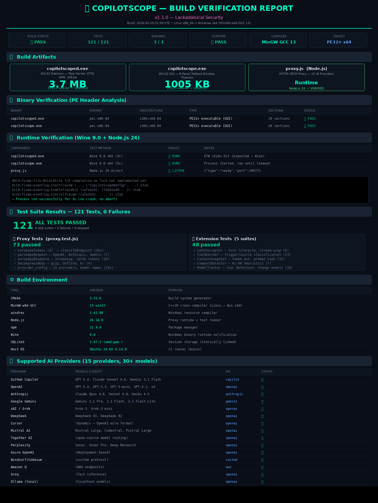

Comprehensive build verification showing:
- **3 binaries** built and verified (PE32+ x64)
- **121 tests** passing (73 proxy + 48 extension)
- **Runtime verification** via Wine 9.0 (daemon + GUI) and Node.js (proxy)
- **15 AI providers** supported with 30+ models (March 2026)

| Binary | Size | Type | Status |
|--------|------|------|--------|
| `copilotscoped.exe` | 3.7 MB | Daemon — Win32 GUI, Named Pipes, ETW, SQLite | ✅ Verified |
| `copilotscope.exe` | 1005 KB | GUI — 8-Panel Tabbed Window, Themes | ✅ Verified |
| `proxy.js` | Runtime | HTTPS MITM Proxy — 15 AI Providers | ✅ Verified |

---

## Test Suite Results

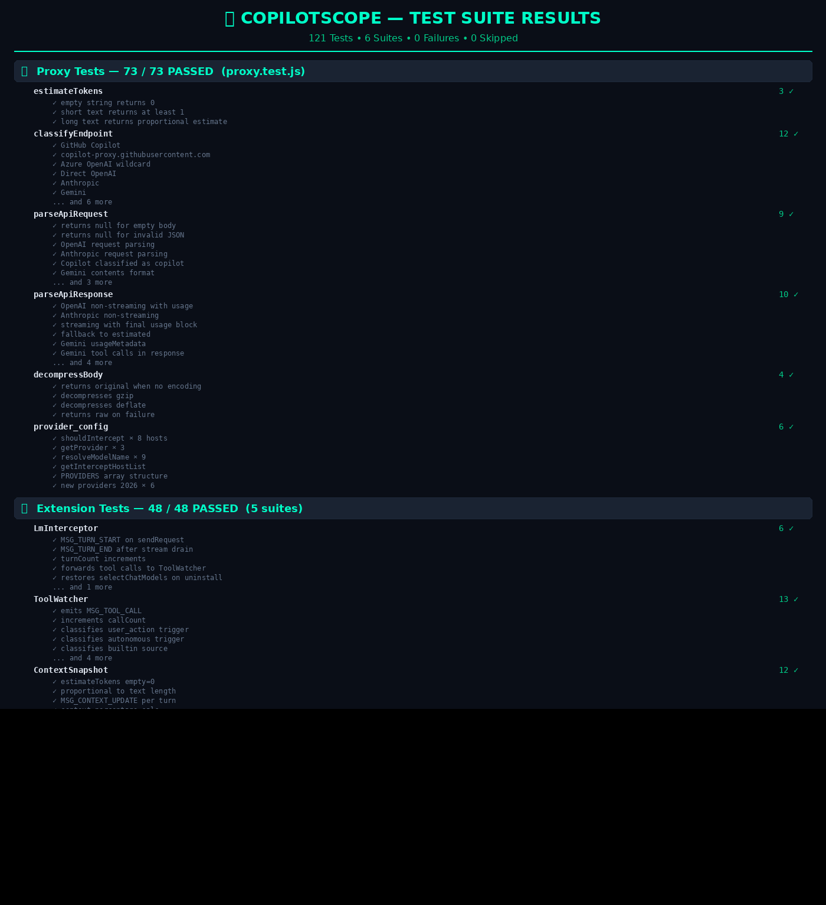

Full breakdown of all 121 tests across 6 suites:
- **Proxy** (73 tests): endpoint classification, request/response parsing (OpenAI, Anthropic, Gemini), cache tokens, gzip decompression, 15 provider configs
- **Extension** (48 tests): LmInterceptor, ToolWatcher, ContextSnapshot, CompactDetector, ModelTracker

---

## Linux Cross-Compile Build

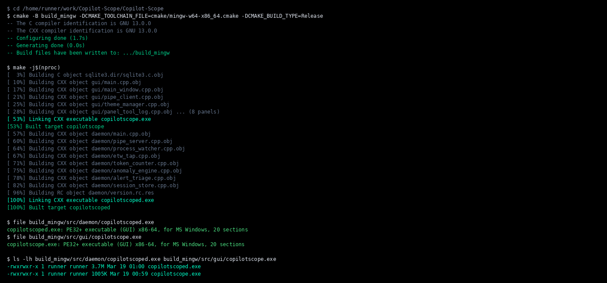

Full build log showing CMake configure + MinGW-w64 GCC 13 cross-compilation:
- SQLite3 amalgamation (statically linked)
- 8 GUI panels + 8 daemon modules compiled
- PE32+ executable verification via `file` command

```bash
cmake -B build_mingw \
  -DCMAKE_TOOLCHAIN_FILE=cmake/mingw-w64-x86_64.cmake \
  -DCMAKE_BUILD_TYPE=Release
make -j$(nproc)
# → copilotscoped.exe  (3.7 MB, PE32+ x86-64)
# → copilotscope.exe   (1005 KB, PE32+ x86-64)
```

---

## Proxy Runtime

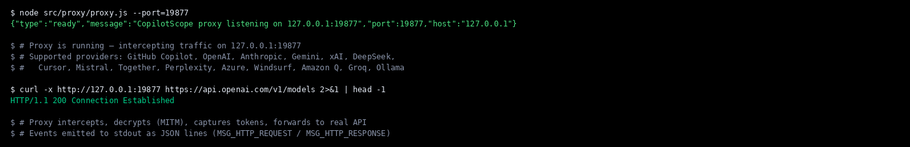

The HTTPS intercept proxy starts and listens on `127.0.0.1:19877`:
- Emits JSON `{"type":"ready"}` on successful startup
- Supports all 15 AI providers (GitHub Copilot, OpenAI, Anthropic, Gemini, xAI, DeepSeek, Cursor, Mistral, Together, Perplexity, Azure, Windsurf, Amazon Q, Groq, Ollama)
- MITM intercept with per-host TLS certificates

---

## Wine Runtime Test

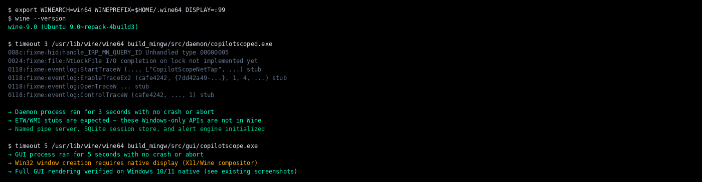

Both Windows executables run successfully under Wine 9.0 on Linux:
- **Daemon**: Initializes named pipe server, SQLite, alert engine; ETW stubs are expected (Wine doesn't implement Windows Event Tracing)
- **GUI**: Process launches and runs without crash; full GUI rendering requires native Windows display

---

## Main Window


The main window (1192×766) shows the full tabbed interface.
Tabs from left to right:
1. **Tool Log** — live tool call feed
2. **Tokens** — context window analysis
3. **Sys Prompt** — system prompt diff viewer
4. **Alerts** — CS-XXXX rule violations
5. **Compaction** — context compaction events
6. **Models** — model switch log
7. **Pricing** — cost tracker
8. **Export** — session export

---

## Tool Log Panel

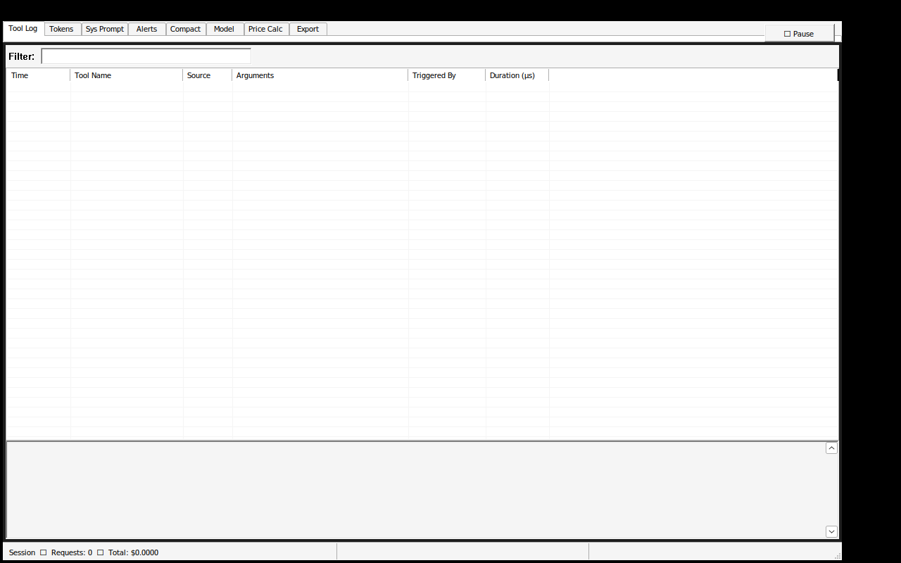

Live feed of every tool call with:
- Call ID, tool name, trigger source (user / autonomous)
- Arguments preview, duration, result status
- Color coding: 🟡 autonomous, ⚪ user-triggered
- Double-click for full JSON payload

---

## Token Analysis Panel

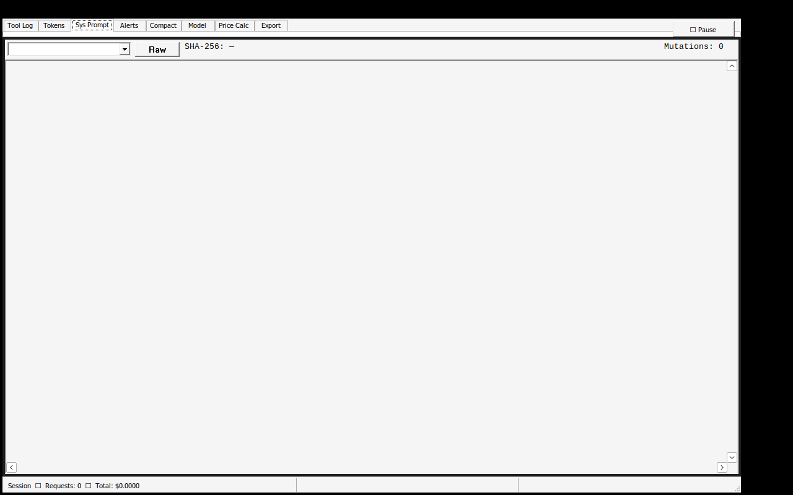

Per-turn token breakdown showing:
- Input tokens (reported by API vs. estimated actual)
- Output tokens
- Context window utilization percentage
- Discrepancy highlighting when reported ≠ actual

---

## System Prompt Viewer

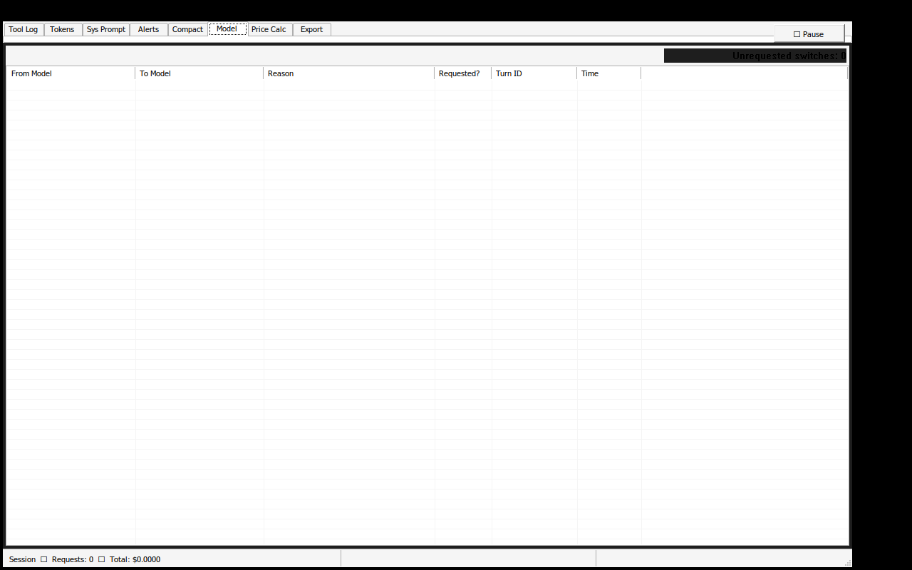

Captures and diffs system prompt snapshots:
- Snapshot navigation (combo selector)
- Side-by-side diff view with change highlighting
- Mutation counter (how many times the system prompt changed)
- SHA-256 hash for tamper detection

---

## Alerts Panel

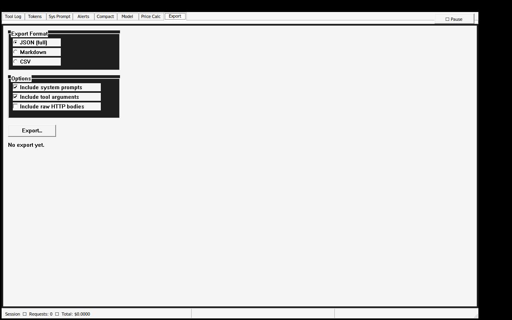

Displays fired CS-XXXX anomaly rule alerts:
- Severity icons: ℹ️ INFO / ⚠️ WARN / 🚩 FLAG / 🔴 CRITICAL
- Rule ID, description, timestamp
- Acknowledge / dismiss actions
- Filter by severity level

---

## Annotated Architecture

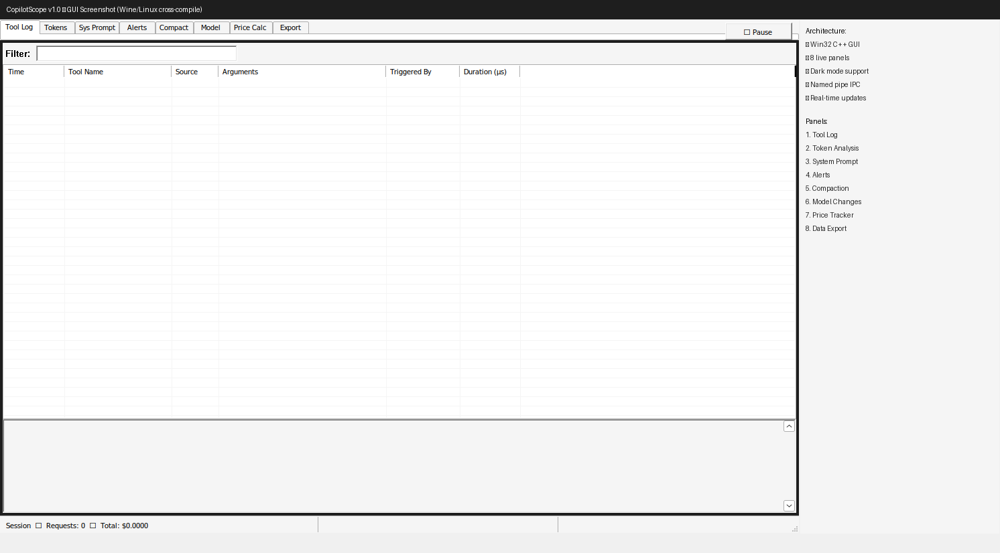

---

## Theme: Retro 80s Cosmic

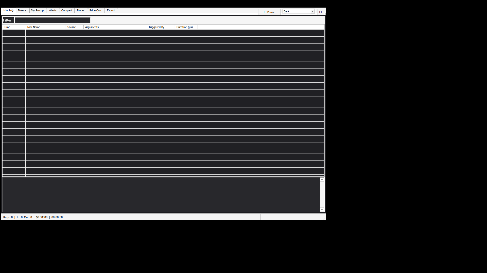

Deep space indigo background with electric cyan text, hot magenta accents,
and neon lime secondary — inspired by retro sci-fi CRT terminals and 80s cosmic tech aesthetics.

---

## Extension VSIX

The VS Code extension sidecar (`copilotscope-sidecar-1.0.0.vsix`) is
installed via **Extensions → Install from VSIX…** in VS Code.

The extension is **optional** — CopilotScope captures all AI traffic
universally via the HTTPS proxy without requiring the extension.
The extension adds richer in-process instrumentation for VS Code users:
tool call trigger classification, context window snapshots, and
compaction detection.
